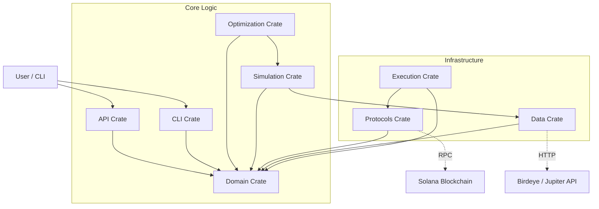

[](./LICENSE)
[](https://crates.io/crates/clmm-liquidity-provider)
[](https://github.com/joaquinbejar/CLMM-Liquidity-Provider/stargazers)
[](https://github.com/joaquinbejar/CLMM-Liquidity-Provider/issues)
[](https://github.com/joaquinbejar/CLMM-Liquidity-Provider/pulls)
[](https://github.com/joaquinbejar/CLMM-Liquidity-Provider/actions)
[](https://codecov.io/gh/joaquinbejar/CLMM-Liquidity-Provider)
[](https://libraries.io/github/joaquinbejar/CLMM-Liquidity-Provider)
[](https://docs.rs/clmm-liquidity-provider)

<div style="text-align: center;">

</div>

# CLMM Liquidity Provider Strategy Optimizer - Solana

A powerful strategy optimization and execution engine for liquidity providers on Solana Concentrated Liquidity Market Makers (CLMMs). This project supports **Raydium CLMM**, **Orca Whirlpools**, and **Meteora DLMM**.

It is designed to help market makers and sophisticated LPs analyze pools, calculate impermanent loss (IL) in real-time, simulate positions over historical data, and execute automated rebalancing strategies based on volatility, volume, and asset correlation.

## 🚀 Value Proposition

DeFi market making requires more than just chasing high APY. This project solves three critical problems:
1.  **Risk Quantification**: Precise calculation of impermanent loss risks before entering positions.
2.  **Range Optimization**: Finding the mathematical optimal tick ranges to maximize fee capture while minimizing IL.
3.  **Scenario Simulation**: Stress-testing positions against historical and Monte Carlo simulated market conditions.

---

## 🏗 Architecture

The project follows a **Domain-Driven Design (DDD)** approach, separated into modular crates within a cargo workspace.



### Module Overview

| Crate | Description |
|-------|-------------|
| **`clmm-lp-domain`** | Core entities, value objects, CLMM math, tick calculations, and IL formulas. |
| **`clmm-lp-simulation`** | Backtesting engine, price path generators, rebalancing strategies, and position simulation. |
| **`clmm-lp-optimization`** | Strategy optimization with Grid Search, objective functions (PnL, Sharpe, IL minimization). |
| **`clmm-lp-protocols`** | Solana protocol adapters (Orca Whirlpools, Raydium CLMM), RPC provider with failover. |
| **`clmm-lp-execution`** | Live monitoring, PnL tracking, alerts, wallet management, transaction building, strategy execution. |
| **`clmm-lp-data`** | Data providers (Birdeye, Jupiter), caching, PostgreSQL repositories. |
| **`clmm-lp-cli`** | CLI with analyze, backtest, optimize, and data commands. Table/chart/export output. |
| **`clmm-lp-api`** | REST API for external integrations and dashboards. |

---

## 🛠 Tech Stack

- **Language**: Rust 🦀
- **Async Runtime**: Tokio
- **Web Framework**: Axum
- **Database**: PostgreSQL (via SQLx)
- **Blockchain**: `solana-sdk`, `solana-client`, `anchor-client`
- **Math**: `rust_decimal`, `u256` for fixed-point precision
- **Logging**: `tracing`
- **Testing**: `proptest` for property-based testing

---

## 📅 Roadmap & Status

The project is being built in incremental phases.

- [x] **Phase 0: Foundation** (Project structure, CI/CD, Makefile)
- [x] **Phase 1: Core Domain Models** (CLMM Math, IL Calculator, basic types)
- [x] **Phase 2: Simulation Engine** (Backtesting framework, rebalancing strategies)
- [x] **Phase 3: Data Integration** (Birdeye/Jupiter providers, Caching)
- [x] **Phase 4: Optimization Engine** (Objective functions, Range optimizer, Grid Search)
- [x] **Phase 5: CLI & Reporting** (Commands, Tables, Charts, JSON/CSV/HTML exports)
- [x] **Phase 6: Database & Persistence** (PostgreSQL schema, Repositories)
- [x] **Phase 7: Blockchain Integration** (RPC provider with failover, Pool/Position readers)
- [x] **Phase 8: Live Monitoring** (Position monitor, PnL tracker, Alert system)
- [x] **Phase 9: Transaction Execution** (Wallet management, Transaction builder, Strategy executor)
- [ ] **Phase 10: Strategy Automation** (Full automation loop, WebSocket subscriptions)
- [ ] **Phase 11: REST API** (Web interface access)

---

## ✨ Features

### Core Capabilities

- **CLMM Mathematics**: Full implementation of concentrated liquidity math (tick ↔ price, sqrt_price, liquidity calculations)
- **Impermanent Loss**: Precise IL calculation for concentrated positions with range boundaries
- **Backtesting**: Simulate LP positions against historical price data with multiple rebalancing strategies
- **Optimization**: Find optimal tick ranges using Grid Search with configurable objective functions
- **Multi-Protocol**: Support for Orca Whirlpools, Raydium CLMM (Meteora DLMM planned)

### Rebalancing Strategies

| Strategy | Description |
|----------|-------------|
| **Static** | Hold position without rebalancing |
| **Periodic** | Rebalance at fixed time intervals |
| **Threshold** | Rebalance when price moves beyond threshold |
| **IL Limit** | Rebalance when impermanent loss exceeds limit |

### Optimization Objectives

- **Maximize Net PnL** - Total return after fees and IL
- **Maximize Fee Earnings** - Focus on fee capture
- **Maximize Sharpe Ratio** - Risk-adjusted returns
- **Minimize IL** - Conservative IL minimization
- **Maximize Time in Range** - Optimize for range efficiency

### Live Monitoring

- **Position Tracking**: Real-time position state from on-chain
- **PnL Calculation**: Entry value, current value, fees, IL, net PnL, APY
- **Alert System**: Configurable rules for range exit, IL thresholds, PnL targets
- **Multi-Channel Notifications**: Console, file, webhook

---

## ⚡️ Quick Start

### Prerequisites
- Rust (latest stable, edition 2024)
- Make
- Docker (optional, for PostgreSQL)

### Common Commands

The project includes a comprehensive `Makefile` for common tasks:

```bash
# Build the project
make build

# Run all tests (Unit & Integration)
make test

# Format code
make fmt

# Run Clippy lints
make lint

# Fix linting issues automatically
make lint-fix

# Generate Documentation
make doc-open
```

### CLI Usage

```bash
# Analyze a trading pair
clmm-lp-cli analyze --symbol-a SOL --symbol-b USDC --days 30

# Run a backtest with periodic rebalancing
clmm-lp-cli backtest --symbol-a SOL --symbol-b USDC \
  --capital 10000 --lower-price 80 --upper-price 120 \
  --strategy periodic --rebalance-interval 24

# Optimize range parameters
clmm-lp-cli optimize --symbol-a SOL --symbol-b USDC \
  --capital 10000 --objective sharpe

# Fetch and cache market data
clmm-lp-cli data fetch --symbol SOL --days 90
```

### Output Formats

The CLI supports multiple output formats:

- **Table**: Rich formatted tables (default)
- **JSON**: Machine-readable JSON output
- **CSV**: Spreadsheet-compatible export
- **HTML**: Web-ready reports
- **Markdown**: Documentation-friendly format

---

## 📂 Project Structure

```text
clmm-lp-optimizer/
├── Cargo.toml              # Workspace configuration
├── Makefile                # Task runner
├── crates/
│   ├── api/                # REST API endpoints (Axum)
│   ├── cli/                # CLI with commands and output formatting
│   │   ├── commands/       # analyze, backtest, optimize, data
│   │   └── output/         # table, chart, export modules
│   ├── data/               # Data providers (Birdeye, Jupiter, cache)
│   ├── domain/             # Core business logic & CLMM math
│   │   ├── entities/       # Pool, Position, Token
│   │   ├── metrics/        # IL, fees, PnL calculations
│   │   └── math/           # Tick math, liquidity, sqrt_price
│   ├── execution/          # Live execution engine
│   │   ├── alerts/         # Alert rules and notifiers
│   │   ├── monitor/        # Position monitor, PnL tracker
│   │   ├── strategy/       # Decision engine, executor
│   │   ├── transaction/    # Builder, manager
│   │   └── wallet/         # Wallet management
│   ├── optimization/       # Grid search, objective functions
│   ├── protocols/          # Protocol adapters
│   │   ├── orca/           # Whirlpool reader, position reader
│   │   ├── rpc/            # RPC provider with health checks
│   │   └── events/         # Event fetcher and parser
│   └── simulation/         # Backtesting engine
│       ├── models/         # Price path, volume, liquidity
│       └── strategies/     # Static, Periodic, Threshold, IL Limit
└── doc/                    # Detailed documentation
    ├── steps.md            # Implementation roadmap
    └── resume.md           # Project overview
```

## 🧪 Testing Strategy

We employ a rigorous testing strategy to ensure financial safety:
1.  **Unit Tests**: For all mathematical formulas (Tick Math, IL).
2.  **Property-Based Tests**: To verify invariants (e.g., "Liquidity can never be negative").
3.  **Integration Tests**: Mocked RPC calls to verify protocol adapters.
4.  **Simulation**: Monte Carlo runs to stress-test strategies.

## Contribution and Contact

We welcome contributions to this project! If you would like to contribute, please follow these steps:

1. Fork the repository.
2. Create a new branch for your feature or bug fix.
3. Make your changes and ensure that the project still builds and all tests pass.
4. Commit your changes and push your branch to your forked repository.
5. Submit a pull request to the main repository.

If you have any questions, issues, or would like to provide feedback, please feel free to contact the project maintainer:

### **Contact Information**

- **Author**: Joaquín Béjar García
- **Email**: jb@taunais.com
- **Telegram**: [@joaquin_bejar](https://t.me/joaquin_bejar)
- **Repository**: <https://github.com/joaquinbejar/CLMM-Liquidity-Provider>
- **Documentation**: <https://docs.rs/clmm-liquidity-provider>

We appreciate your interest and look forward to your contributions!

## ✍️ License

Licensed under **MIT** license