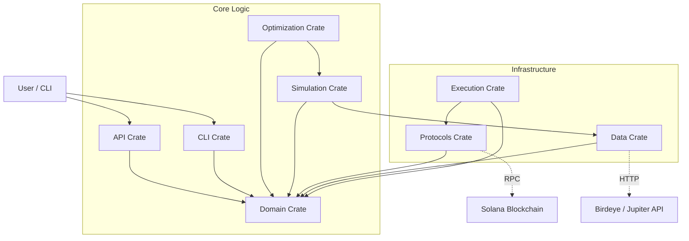

<div style="text-align: center;">

</div>

[](./LICENSE)
[](https://crates.io/crates/clmm-liquidity-provider)
[](https://crates.io/crates/clmm-liquidity-provider)
[](https://github.com/joaquinbejar/CLMM-Liquidity-Provider/stargazers)
[](https://github.com/joaquinbejar/CLMM-Liquidity-Provider/issues)
[](https://github.com/joaquinbejar/CLMM-Liquidity-Provider/pulls)
[](https://github.com/joaquinbejar/CLMM-Liquidity-Provider/actions)
[](https://codecov.io/gh/joaquinbejar/CLMM-Liquidity-Provider)
[](https://libraries.io/github/joaquinbejar/CLMM-Liquidity-Provider)
[](https://docs.rs/clmm-liquidity-provider)

# CLMM Liquidity Provider Strategy Optimizer - Solana

A powerful strategy optimization and execution engine for liquidity providers on Solana Concentrated Liquidity Market Makers (CLMMs). This project supports **Raydium CLMM**, **Orca Whirlpools**, and **Meteora DLMM**.

It is designed to help market makers and sophisticated LPs analyze pools, calculate impermanent loss (IL) in real-time, simulate positions over historical data, and execute automated rebalancing strategies based on volatility, volume, and asset correlation.

## 🚀 Value Proposition

DeFi market making requires more than just chasing high APY. This project solves three critical problems:
1.  **Risk Quantification**: Precise calculation of impermanent loss risks before entering positions.
2.  **Range Optimization**: Finding the mathematical optimal tick ranges to maximize fee capture while minimizing IL.
3.  **Scenario Simulation**: Stress-testing positions against historical and Monte Carlo simulated market conditions.

---

## 🏗 Architecture

The project follows a **Domain-Driven Design (DDD)** approach, separated into modular crates within a cargo workspace.



### Module Overview

| Crate | Description |
|-------|-------------|
| **`clmm-lp-domain`** | Core entities, value objects, and pure mathematical logic (CLMM math, IL calc). |
| **`clmm-lp-simulation`** | Backtesting engine, price path generation, and position simulation. |
| **`clmm-lp-optimization`** | Strategy optimization algorithms (Grid Search, Genetic Algorithms). |
| **`clmm-lp-protocols`** | Adapters for Solana protocols (Raydium, Orca, Meteora). |
| **`clmm-lp-execution`** | Live execution engine, wallet management, and transaction building. |
| **`clmm-lp-data`** | Data ingestion, historical price fetching, and storage repositories. |
| **`clmm-lp-cli`** | Command-line interface for running simulations and optimizations. |
| **`clmm-lp-api`** | REST API for external integrations and dashboards. |

---

## 🛠 Tech Stack

- **Language**: Rust 🦀
- **Async Runtime**: Tokio
- **Web Framework**: Axum
- **Database**: PostgreSQL (via SQLx)
- **Blockchain**: `solana-sdk`, `solana-client`, `anchor-client`
- **Math**: `rust_decimal`, `u256` for fixed-point precision
- **Logging**: `tracing`
- **Testing**: `proptest` for property-based testing

---

## 📅 Roadmap & Status

The project is being built in incremental phases.

- [x] **Phase 0: Foundation** (Project structure, CI/CD, Makefile)
- [ ] **Phase 1: Core Domain Models** (CLMM Math, IL Calculator, basic types)
- [ ] **Phase 2: Simulation Engine** (Backtesting framework, simplistic models)
- [ ] **Phase 3: Data Integration** (Birdeye/Jupiter providers, Caching)
- [ ] **Phase 4: Optimization Engine** (Objective functions, Range optimizer)
- [ ] **Phase 5: CLI & Reporting** (User tools, Charts, Exports)
- [ ] **Phase 6: Database & Persistence** (PostgreSQL schema, Repositories)
- [ ] **Phase 7: Blockchain Integration** (RPC connection, On-chain state parsing)
- [ ] **Phase 8: Live Monitoring** (Real-time PnL tracking, Alerts)
- [ ] **Phase 9: Transaction Execution** (Wallet, Transaction builder, Slippage protection)
- [ ] **Phase 10: Strategy Automation** (Automated rebalancing, Decision engine)
- [ ] **Phase 11: REST API** (Web interface access)

---

## ⚡️ Quick Start

### Prerequisites
- Rust (latest stable)
- Make
- Docker (optional, for DB/tests)

### Common Commands

The project includes a comprehensive `Makefile` for common tasks:

```bash
# Build the project
make build

# Run all tests (Unit & Integration)
make test

# Format code
make fmt

# Run Clippy lints
make lint

# Fix linting issues automatically
make lint-fix

# Generate Documentation
make doc-open
```

---

## 📂 Project Structure

```text
clmm-lp-optimizer/
├── Cargo.toml          # Workspace configuration
├── Makefile            # Task runner
├── crates/
│   ├── api/            # REST API endpoints
│   ├── cli/            # CLI entry point
│   ├── data/           # Data providers (Coingecko, Birdeye)
│   ├── domain/         # Core business logic & models
│   ├── execution/      # On-chain transaction executors
│   ├── optimization/   # Genetic/Grid search algorithms
│   ├── protocols/      # Raydium/Orca/Meteora adapters
│   └── simulation/     # Backtesting engine
└── doc/                # Detailed documentation
    ├── steps.md        # Implementation roadmap
    └── resume.md       # Project overview
```

## 🧪 Testing Strategy

We employ a rigorous testing strategy to ensure financial safety:
1.  **Unit Tests**: For all mathematical formulas (Tick Math, IL).
2.  **Property-Based Tests**: To verify invariants (e.g., "Liquidity can never be negative").
3.  **Integration Tests**: Mocked RPC calls to verify protocol adapters.
4.  **Simulation**: Monte Carlo runs to stress-test strategies.

## Contribution and Contact

We welcome contributions to this project! If you would like to contribute, please follow these steps:

1. Fork the repository.
2. Create a new branch for your feature or bug fix.
3. Make your changes and ensure that the project still builds and all tests pass.
4. Commit your changes and push your branch to your forked repository.
5. Submit a pull request to the main repository.

If you have any questions, issues, or would like to provide feedback, please feel free to contact the project maintainer:

### **Contact Information**

- **Author**: Joaquín Béjar García
- **Email**: jb@taunais.com
- **Telegram**: [@joaquin_bejar](https://t.me/joaquin_bejar)
- **Repository**: <https://github.com/joaquinbejar/CLMM-Liquidity-Provider>
- **Documentation**: <https://docs.rs/clmm-liquidity-provider>

We appreciate your interest and look forward to your contributions!

## ✍️ License

Licensed under **MIT** license
